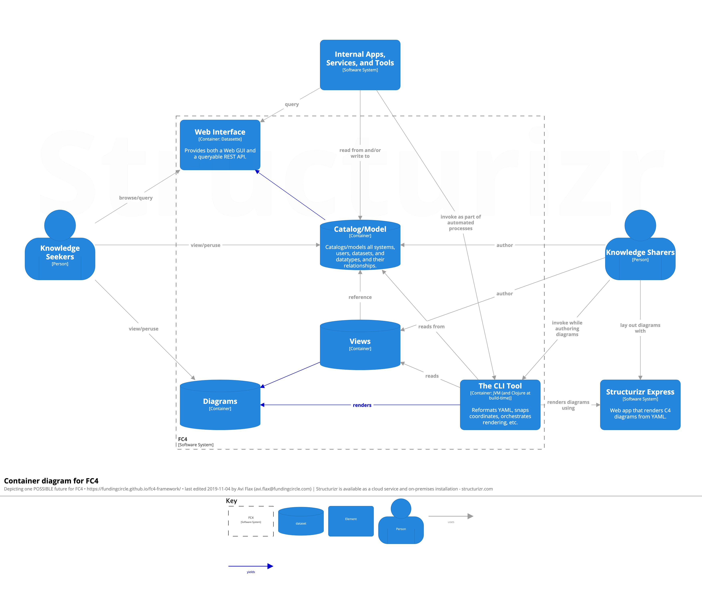

# The Future of FC4

## Today

Today, FC4 is:

> …a framework that enables software creators and documentarians to author, publish, and maintain
> software architecture diagrams more effectively, efficiently, and collaboratively over time.

So far it’s been fairly successful in achieving that purpose. Since its inception ~20 months ago
we’ve created at least 24 substantial diagrams within Funding Circle, some of which we’ve updated
and re-published numerous times; it’s also being used at the
[UK Ministry of Justice][laa-architectural-diagrams-repo] and at [Warby Parker][warby-parker].

However:

* Numerous people have asked why the diagram data format couples the “content” and the
  “presentation” — it seems this aspect of FC4 is a “smell” for some people
* I’ve found that because each diagram definition is completely discrete and self-contained, any
  element that appears on multiple diagrams — which is many of them — is therefore defined
  repeatedly and duplicatively, leading to drift and inconsistencies, and/or increased maintenance
  overhead to keep the definitions in sync
* Similarly, because styles must be defined for each diagram, it’s difficult and/or costly to
  maintain a consistent visual style across a corpus of diagrams
* I’ve heard from 4–5 people across Funding Circle that their jobs would be much easier if we had a
  central-single-source-of-truth catalog for all of our systems
* [Simon Brown][simon-brown] (the creator of [C4][c4-model], [Structurizr][structurizr], and
  [Structurizr Express][structurizr-express]) has been persistent and consistent in his posts that
  while people may come for the diagrams, they stay for the models — i.e. the core value in C4 is
  *modeling* rather than *diagramming* ([example][simon-brown-example-tweet])
* The data format/DSL used by FC4, which was defined by Simon Brown using JSON conventions for use
  within Structurizr Express (SE), isn’t particularly expressive
  * It wouldn’t be hard to devise a more expressive data format/DSL (and in fact we’ve
    [already done so][ep01])

## A Proposed Future

Therefore, I propose that in the near future we redefine FC4 as:

> …a tool for cataloguing, modeling, and documenting software systems.

And:

* Finish implementing the changes defined in [EP01][ep01] that will decouple FC4 models and views
  with a new DSL
* Shift the central focus of FC4 from *views/diagrams* to a single, central, unified
  *model/catalog* of *all* relevant systems, people, and other elements
* Add a feature that would publish the *model/catalog* as a data-oriented website that would be
  both browseable by humans and queryable by machines via a Web API
  * This feature would leverage [Datasette][datasette] heavily; the only non-trivial implementation
    work would be to export the model/catalog to an SQLite database. Datasette would take it from
    there.

Here’s a [Container diagram][container-diagram] that depicts this possible future of FC4:

As you can see, this conception of FC4 places the model/catalog at the center of the system — it’s
_the data_ that’s the most valuable element of the system.

## Getting There

Here’s some guesses about the scale of the work involved in implementing this future:

Change | Nature of the Work | Status | Scale in Person-Weeks
------ | ------------------ | ------ | -----
Finish implementing the new DSL as per EP01 | UX design, implementation in code | In progress | ~2–8
Shift the central focus | Mostly reorganizing and revising the docs | Good chunk of thinking has been done | ~1
Feature to publish the model/catalog as a Web site+API | Mostly exporting the data to SQLite | Not started | ~2–3

These guesses assume that I’m doing most of the work, mostly on my own.

## Open Questions

* Should FC4 retain the ability to work with SE diagram definitions?
  * Could be useful, and would certainly help with backwards-compatibility, but would also make FC4
    more complex, harder to maintain, and harder to explain.
  * I’m inclined to keep supporting SE diagrams alongside the new DSL for ~6 months or so, and then
    remove it. The only support I’d be included to retain would be a feature to convert an SE
    diagram to the new DSL.
* Should FC4’s formatting feature support the new model DSL?
  * Since the files using the new DSL won’t be processed by SE, changes made to those files will be
    mostly intentional — in other words, we won’t be dealing with the “diff noise” that SE tends to
    introduce; eliminating this noise is the primary value of this feature — I think.
  * Also, the feature is lossy; [it erases comments][issue-9-preserve-comments]. This is pretty
    terrible, and non-trivial to fix.

## Feedback Please!

This is what I have in mind, but my ideas need to be challenged and honed by questions, concerns,
suggestions, etc. Please share any thoughts you might have on any aspect of this proposal!

[c4-model]: https://c4model.com
[container-diagram]: https://c4model.com/#coreDiagrams
[datasette]: https://datasette.readthedocs.io/en/stable/
[ep01]: https://github.com/FundingCircle/fc4-framework/blob/7984a94/proposals/ep01-decouple-models-and-views-new-dsl/ep01-decouple-models-and-views-new-dsl.md
[issue-9-preserve-comments]: https://github.com/FundingCircle/fc4-framework/issues/9
[laa-architectural-diagrams-repo]: https://github.com/ministryofjustice/laa-architectural-diagrams
[simon-brown]: https://simonbrown.je
[simon-brown-example-tweet]: https://twitter.com/simonbrown/status/1191285136110817286
[structurizr]: https://structurizr.com/
[structurizr-express]: https://structurizr.com/express
[warby-parker]: https://www.warbyparker.com
